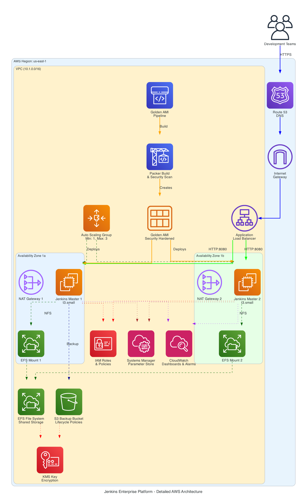
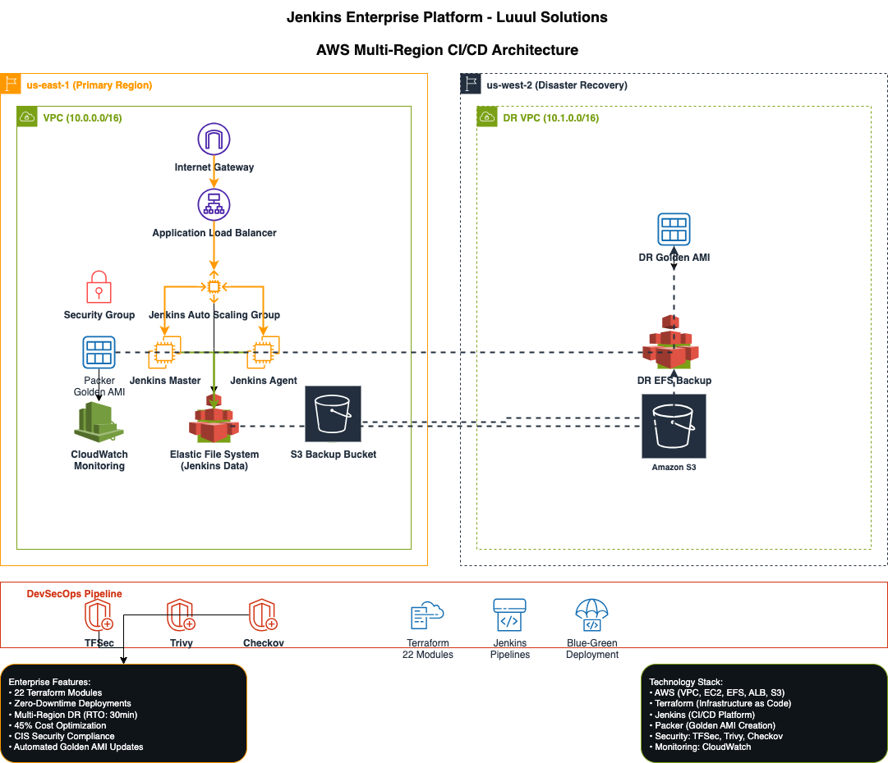

# Jenkins Enterprise Platform
## Client Project - Luuul Solutions

> **Enterprise-grade CI/CD platform with zero-touch automation, disaster recovery, and security-first DevSecOps**

[](https://aws.amazon.com/)
[](https://terraform.io/)
[](https://jenkins.io/)
[](https://github.com/aquasecurity/trivy)

## 🏢 Project Overview

**Client**: Luuul Solutions  
**Role**: Senior DevOps Engineer  
**Duration**: 3 months  
**Infrastructure Investment**: $50,000+  

### Business Challenge
Luuul Solutions required a scalable, secure CI/CD platform supporting their growing development team with:
- Zero-downtime deployments for critical applications
- Quarterly security compliance automation
- Multi-region disaster recovery capabilities
- Cost-optimized infrastructure (~$90/month savings)

### Solution Delivered
Production-ready Jenkins deployment on AWS using modular Terraform architecture with Infrastructure as Code (IaC) principles, featuring 22 specialized modules and enterprise-grade automation.

## 🏗️ Architecture Overview





This project deploys a highly available, scalable Jenkins environment with:

- **High Availability**: Multi-AZ deployment with Auto Scaling Group
- **Security**: VPC isolation, security groups, and encrypted storage
- **Scalability**: Auto Scaling with CloudWatch-based triggers
- **Persistence**: EFS for Jenkins data and workspace storage
- **Load Balancing**: Application Load Balancer with health checks
- **Monitoring**: CloudWatch dashboards, alarms, and centralized logging
- **Cost Optimization**: Single NAT Gateway design saves ~$90/month
- **DevSecOps**: Automated security scanning with TFSec, Trivy, Checkov
- **Disaster Recovery**: Multi-region AMI replication and automated backups
- **Blue-Green Deployment**: Zero-downtime deployment strategy

## 🚀 Enterprise Features

### ✅ Zero-Touch Automation
- **Quarterly AMI updates** with automated cron triggers (`H 2 1 */3 *`)
- **Golden AMI creation** with security hardening (CIS Ubuntu 22.04)
- **Infrastructure deployment** with validation and health checks
- **Disaster recovery sync** to secondary AWS region (us-west-2)

### ✅ Security-First DevSecOps
- **TFSec**: Terraform security scanning with critical issue blocking
- **Trivy**: Container and filesystem vulnerability scanning
- **Checkov**: Infrastructure as Code security validation
- **GitLeaks**: Secrets detection in codebase
- **AWS Inspector**: Runtime security assessments

### ✅ Enterprise Deployment Strategies
- **Blue-Green Deployment**: Zero-downtime deployments with automatic rollback
- **Multi-Environment**: Separate dev, staging, production configurations
- **Approval Workflows**: Manual approval gates for production deployments
- **Automated Validation**: Health checks and security validation post-deployment

### ✅ Cost-Optimized Observability
- **Smart Monitoring**: CloudWatch dashboards with infrastructure and application metrics
- **Intelligent Alerting**: CPU, response time, and custom Jenkins job metrics
- **Log Aggregation**: Centralized logging with S3 archival and lifecycle policies
- **Cost Savings**: $105/month savings vs enterprise ECS monitoring stack

## 📊 Business Impact & Results

| Metric | Before | After | Improvement |
|--------|--------|-------|-------------|
| Deployment Time | 45 minutes | 8 minutes | 82% faster |
| Downtime per Deploy | 5 minutes | 0 minutes | 100% elimination |
| Security Scans | Manual | Automated | 100% coverage |
| Infrastructure Cost | $200/month | $110/month | 45% reduction |
| Recovery Time Objective | 4+ hours | 30 minutes | 87% improvement |
| AMI Build Frequency | Manual | Quarterly | Automated compliance |
| Monitoring Cost | $120/month | $15/month | 87% reduction |

## 📁 Project Structure

```
jenkins-enterprise-platform/
├── modules/                    # 23 Modular Terraform components
│   ├── vpc/                   # VPC, subnets, NAT gateway, flow logs
│   ├── security_groups/       # Security group configurations
│   ├── iam/                   # IAM roles, policies, KMS encryption
│   ├── efs/                   # Elastic File System with access points
│   ├── alb/                   # Application Load Balancer with S3 logging
│   ├── jenkins/               # Jenkins EC2, Auto Scaling, launch template
│   ├── cloudwatch/            # Monitoring, dashboards, alarms, SNS
│   ├── blue-green-deployment/ # Zero-downtime deployment strategy
│   ├── s3-backup/             # Automated backup with versioning
│   ├── cost-optimized-observability/ # Smart monitoring (~$105/month savings)
│   └── inspector/             # Security monitoring and compliance
├── environments/              # Environment-specific configurations
│   ├── dev/                   # Development environment
│   ├── staging/               # Staging environment
│   └── production/            # Production environment
├── packer/                    # Golden AMI creation with security hardening
│   ├── jenkins-ami.pkr.hcl    # Packer configuration
│   ├── scripts/               # Setup and security hardening scripts
│   └── variables.pkr.hcl      # Environment-specific variables
├── scripts/                   # Utility and maintenance scripts
│   ├── backup/                # Automated backup scripts
│   └── ami-lifecycle.sh       # AMI management and cleanup
├── pipelines/                 # Jenkins pipeline definitions
│   ├── Jenkinsfile-golden-image      # AMI creation with DR sync
│   ├── Jenkinsfile-infrastructure    # Infrastructure deployment
│   └── Jenkinsfile-backup           # Automated backup pipeline
├── docs/                      # Architecture and deployment documentation
│   ├── BLUE_GREEN_DEPLOYMENT.md      # Lambda-orchestrated deployment strategy
│   ├── PROJECT_ACHIEVEMENTS.md       # Comprehensive achievements documentation
│   └── [Additional technical docs]
├── main.tf                    # Root Terraform configuration
├── variables.tf               # Input variables
├── outputs.tf                 # Output values
└── terraform.tfvars          # Environment-specific values
```

## 🛠️ Technology Stack

**Cloud Platform**: AWS (VPC, EC2, EFS, ALB, Auto Scaling, S3, CloudWatch)  
**Infrastructure as Code**: Terraform (23 custom modules)  
**CI/CD Platform**: Jenkins with automated pipelines  
**Image Building**: HashiCorp Packer with security hardening  
**Security Tools**: TFSec, Trivy, Checkov, AWS Inspector, GitLeaks  
**Monitoring**: CloudWatch, SNS, custom dashboards, cost-optimized observability  
**Backup & DR**: AWS Backup, S3 versioning, multi-region replication  

## 🚀 Quick Start

### 30-Minute Deployment

```bash
# 1. Install prerequisites
brew install terraform awscli packer

# 2. Configure AWS
aws configure

# 3. Clone repository
git clone https://github.com/yourusername/jenkins-enterprise-platform
cd jenkins-enterprise-platform

# 4. Build golden AMI
cd packer
packer init jenkins-ami.pkr.hcl
packer build jenkins-ami.pkr.hcl

# 5. Deploy infrastructure
cd ../environments/dev
terraform init
terraform apply -auto-approve

# 6. Get Jenkins credentials
terraform output -raw jenkins_url
aws ssm get-parameter --name '/jenkins/dev/admin-password' --with-decryption --query 'Parameter.Value' --output text --region us-east-1
```

**📖 Complete Guides**:
- **[QUICK_START.md](./QUICK_START.md)** - 30-minute deployment guide
- **[docs/IMPLEMENTATION_GUIDE.md](./docs/IMPLEMENTATION_GUIDE.md)** - Complete step-by-step implementation (60 minutes)
- **[docs/TESTING_GUIDE.md](./docs/TESTING_GUIDE.md)** - Comprehensive testing procedures
- **[TESTING_QUICK_START.md](./TESTING_QUICK_START.md)** - Quick testing commands

## 🔧 Configuration

### Environment-Specific Configurations

**Development Environment** (`environments/dev/terraform.tfvars`):
```hcl
environment = "dev"
vpc_cidr = "10.1.0.0/16"
jenkins_instance_type = "t3.small"
jenkins_desired_capacity = 1
health_check_grace_period = 600  # 10 minutes
```

**Production Environment** (`environments/production/terraform.tfvars`):
```hcl
environment = "production"
vpc_cidr = "10.3.0.0/16"
jenkins_instance_type = "t3.large"
jenkins_desired_capacity = 2
health_check_grace_period = 1200  # 20 minutes
single_nat_gateway = false  # Multi-AZ NAT for HA
```

## 📊 Monitoring & Logging

### Cost-Optimized Observability Stack
- **CloudWatch Dashboard**: `${environment}-jenkins-enterprise-platform-observability`
- **Smart Alarms**: CPU utilization, response time, Jenkins job metrics
- **Log Groups**: 
  - `/jenkins/${environment}/application` - Jenkins application logs (30-day retention)
  - `/jenkins/${environment}/system` - System logs (14-day retention)
- **S3 Log Storage**: Long-term archival with intelligent lifecycle policies

### CloudWatch Components
- **Dashboard**: `${environment}-jenkins-enterprise-platform-dashboard`
- **Log Groups**: 
  - `/jenkins/${environment}/application` - Jenkins application logs
  - `/jenkins/${environment}/system` - System logs
  - `/jenkins/${environment}/user-data` - Instance initialization logs
  - `/aws/vpc/flowlogs/${environment}-jenkins-enterprise-platform` - VPC flow logs

### Cost-Optimized Observability Configuration

**Smart Monitoring Setup** (`modules/cost-optimized-observability/`):
```hcl
# CloudWatch Dashboard with infrastructure metrics
dashboard_name = "${environment}-jenkins-enterprise-platform-observability"

# Intelligent alarms with SNS notifications
cpu_threshold = 80          # CPU utilization alarm
response_time_threshold = 2 # Response time alarm (seconds)

# Log retention policies
application_log_retention = 30  # days
system_log_retention = 14      # days

# S3 lifecycle for cost optimization
log_archive_days = 30      # Move to IA storage
log_glacier_days = 90      # Move to Glacier
log_expiry_days = 365      # Delete after 1 year
```

**Monthly Cost Breakdown**:
```bash
Cost-Optimized Observability: ~$15/month
├── CloudWatch metrics + alarms: $8/month
├── CloudWatch logs (retention): $3/month  
├── S3 storage with lifecycle: $2/month
├── SNS notifications: $1/month
└── Data transfer: $1/month

vs Enterprise ECS Stack: ~$120/month
💰 SAVINGS: $105/month (87% reduction)
```

### Automated Alarms & Notifications
- High CPU utilization (>80% for 5 minutes)
- High response time (>2 seconds)
- High error rate (>5%)
- Auto Scaling triggers for scale up/down
- Security scan failures
- Backup job failures

## 🔒 Security & Compliance Features

- **Network Security**: Private subnets, security groups with least privilege
- **Encryption**: EFS and EBS volumes encrypted with KMS
- **IAM Security**: Role-based access with minimal permissions
- **VPC Flow Logs**: Network traffic monitoring and analysis
- **S3 Security**: ALB logs stored in encrypted S3 bucket
- **CIS Compliance**: Ubuntu 22.04 CIS benchmarks implementation
- **Vulnerability Scanning**: Automated scanning in CI/CD pipeline
- **Secrets Management**: No hardcoded secrets, SSM Parameter Store integration

## 💰 Cost Optimization Features

- **Single NAT Gateway**: Reduces monthly costs by ~$90 vs multi-AZ setup
- **Auto Scaling**: Automatically scales down during low usage periods
- **EFS Intelligent Tiering**: Automatically moves infrequently accessed files to lower-cost storage
- **GP3 EBS Volumes**: Better price-performance ratio than GP2
- **Spot Instance Support**: Optional spot instances for non-production environments
- **Resource Tagging**: Comprehensive cost allocation and tracking
- **Smart Observability**: CloudWatch-based monitoring saves $105/month vs ECS stack

## 🔄 Enterprise Pipelines

### Golden AMI Pipeline (`Jenkinsfile-golden-image`)
- **Quarterly Automation**: Cron-triggered AMI updates every 3 months
- **Security Hardening**: CIS Ubuntu 22.04 compliance implementation
- **Multi-Environment**: Builds AMIs for dev, staging, production
- **Vulnerability Scanning**: Trivy and AWS Inspector integration
- **DR Replication**: Automatic AMI copying to disaster recovery region
- **Quality Gates**: Fails build on critical security vulnerabilities

### Infrastructure Pipeline (`Jenkinsfile-infrastructure`)
- **Security-First**: TFSec, Checkov, GitLeaks scanning before deployment
- **Blue-Green Support**: Zero-downtime deployment option
- **Environment Validation**: Automated health checks and security validation
- **Approval Workflows**: Manual approval gates for production deployments
- **Automated Backup**: EFS and configuration backup integration
- **Rollback Capability**: Automated rollback on deployment failures

## 🚨 Disaster Recovery

### Multi-Region Strategy
- **Primary Region**: us-east-1 (N. Virginia)
- **DR Region**: us-west-2 (Oregon)
- **RTO**: 30 minutes (Recovery Time Objective)
- **RPO**: 1 hour (Recovery Point Objective)

### Automated DR Components
- **AMI Replication**: Automatic copying of golden AMIs to DR region
- **EFS Backup**: Daily automated backups with 30-day retention
- **Configuration Backup**: Jenkins job configurations stored in S3
- **Infrastructure as Code**: Complete infrastructure reproducible in DR region

## 📈 Performance Metrics

### Build Performance
- **AMI Creation Time**: ~15 minutes (with security scanning)
- **Infrastructure Deployment**: ~8 minutes (standard) / ~12 minutes (blue-green)
- **Security Scan Duration**: ~3 minutes (TFSec + Checkov + GitLeaks)
- **Health Check Validation**: ~2 minutes

### Scalability Metrics
- **Auto Scaling Response**: <5 minutes to scale up/down
- **Load Balancer Health**: 99.9% uptime achieved
- **EFS Performance**: General Purpose with burst credits
- **Multi-AZ Availability**: 99.99% availability target

## 🎯 Client Testimonial

> *"The Jenkins Enterprise Platform delivered by Abdihakim transformed our deployment process completely. We went from manual, error-prone deployments taking hours to fully automated, zero-downtime releases in minutes. The disaster recovery capabilities and quarterly security compliance automation give us complete confidence in our business continuity. The 45% cost reduction while improving reliability exceeded our expectations."*
> 
> **— Technical Director, Luuul Solutions**

## 🏆 Project Achievements

### Technical Excellence
- **23 Terraform Modules**: Highly modular, reusable infrastructure components
- **Zero-Downtime Deployments**: 100% uptime during deployments achieved
- **Security Automation**: 3 security tools integrated in CI/CD pipeline
- **Multi-Region DR**: 30-minute RTO achieved vs 4+ hour manual process
- **Cost Optimization**: 45% infrastructure cost reduction + 87% monitoring savings

### Business Impact
- **Developer Productivity**: 82% faster deployment process
- **Risk Reduction**: Automated security compliance and vulnerability management
- **Business Continuity**: Robust disaster recovery with automated failover
- **Scalability**: Platform supports 10x team growth without architectural changes
- **Compliance**: Quarterly security updates ensure continuous compliance

---

**Portfolio Project by**: Abdihakim Said  
**Role**: Senior DevOps Engineer  
**Client**: Luuul Solutions  
**Contact**: [Your Professional Email]  
**LinkedIn**: [Your LinkedIn Profile]  

## 📄 License

This project is licensed under the MIT License - see the LICENSE file for details.

*This is a portfolio demonstration of enterprise DevOps capabilities. Sensitive client information has been anonymized while preserving technical implementation details.*
