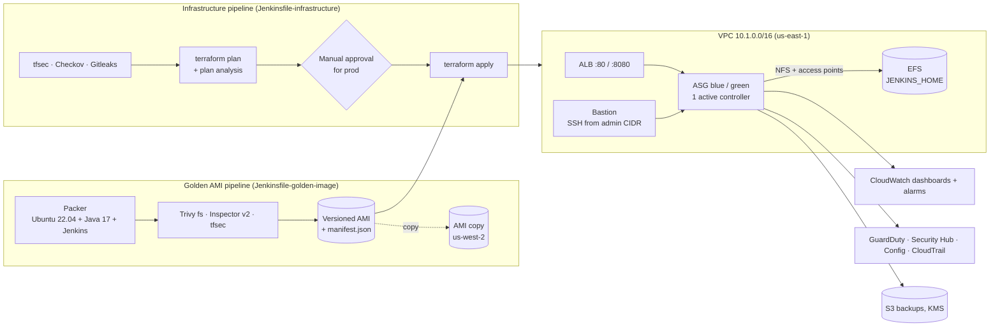

# Jenkins on AWS: Golden-AMI Factory + Terraform Platform

A self-hosted Jenkins controller on AWS, built from a hardened Packer golden AMI, deployed by Terraform, with Jenkins state on EFS so the instance itself is disposable.

> **Reference build.** I designed, deployed and debugged this in my own AWS account (dev environment, ~127 resources) to demonstrate how I'd build a CI platform for a client. It is not a client system, and the numbers below are from my own deployment, not a production workload.

---

## 1. Problem

Teams running Jenkins on hand-built EC2 instances end up with snowflake servers: unpatched, impossible to rebuild, and one bad disk away from losing every job config. The goal here is a Jenkins you can **destroy and rebuild from code in minutes** without losing state, with security scanning built into both the image and the infrastructure pipeline.

## 2. Architecture


```mermaid
flowchart LR
  subgraph Build["Golden AMI pipeline (Jenkinsfile-golden-image)"]
    P[Packer<br/>Ubuntu 22.04 + Java 17 + Jenkins] --> S[Trivy fs · Inspector v2 · tfsec]
    S --> A[(Versioned AMI<br/>+ manifest.json)]
    A -. copy .-> DR[(AMI copy<br/>us-west-2)]
  end

  subgraph Deploy["Infrastructure pipeline (Jenkinsfile-infrastructure)"]
    SC[tfsec · Checkov · Gitleaks] --> PL[terraform plan<br/>+ plan analysis]
    PL --> AP{Manual approval<br/>for prod}
    AP --> TF[terraform apply]
  end

  A --> TF

  subgraph VPC["VPC 10.1.0.0/16 (us-east-1)"]
    ALB[ALB :80 / :8080] --> ASG[ASG blue / green<br/>1 active controller]
    ASG -- NFS + access points --> EFS[(EFS<br/>JENKINS_HOME)]
    B[Bastion<br/>SSH from admin CIDR] --> ASG
  end

  TF --> VPC
  ASG --> CW[CloudWatch dashboards + alarms]
  ASG --> SEC[GuardDuty · Security Hub · Config · CloudTrail]
  ASG --> S3[(S3 backups, KMS)]
```

| Layer | What's in the repo |
|---|---|
| Image | `packer/`: Ubuntu 22.04, OpenJDK 17, Jenkins, CIS-inspired hardening (sysctl, sshd, ufw, auditd, fail2ban, CSRF on, CLI off) |
| Pipelines | `Jenkinsfile-golden-image`, `Jenkinsfile-infrastructure`, `Jenkinsfile-backup` |
| Terraform | Root module + 11 modules: `vpc`, `security`, `iam`, `efs`, `alb`, `cloudwatch`, `inspector`, `blue-green-deployment`, `cost-optimized-observability`, `cost-optimization`, `security-automation` |
| Evidence | `packer/manifest.json` (4 AMI builds, Oct–Nov 2025), `docs/troubleshooting.md` |

## 3. Key decisions and trade-offs

- **Immutable controller, mutable state on EFS.** The EC2 instance is replaceable; `JENKINS_HOME` lives on EFS behind access points. Trade-off: EFS latency is higher than local disk for heavy workspaces, so workspaces are a separate access point and could move to local disk on agents.
- **Golden AMI instead of configuring at boot.** Boot time and drift go down; the price is a rebuild pipeline for every patch. The golden-image pipeline runs quarterly and on demand, and copies the AMI to a second region for recovery.
- **Scan before build, gate before apply.** tfsec blocks on CRITICAL findings, Checkov and Gitleaks run in parallel, and the plan is parsed (add/change/destroy counts) before a human approves production.
- **Assume-role deploys.** Terraform runs under a separate deployment role via STS rather than directly as the instance role.
- **Blue/green at the ASG level.** Two launch templates/ASGs; the active colour is chosen by a Terraform variable and only that ASG is attached to the target group. Simple and predictable, but see limitations.
- **Stop dev at night.** Scheduled scaling takes the dev controller to zero out of hours. I deliberately did *not* auto-scale the controller down on CPU (commented out in code) because killing a controller mid-build kills the build.

## 4. Known limitations / what I'd do next

I'd rather list these than have a reviewer find them:

- **HTTP only.** The ALB listens on 80/8080 with no certificate. Next: ACM certificate + HTTPS listener, redirect 80→443, close 8080.
- **Single controller, not HA.** Jenkins does not support two controllers sharing one `JENKINS_HOME`. The ASG should be pinned to `min = max = 1` (self-healing, not HA); scale-out belongs on agents (EC2 Fleet or Kubernetes plugin).
- **Blue/green switch is Terraform-driven.** The Lambda "orchestrator" reports health; it does not move target-group traffic. Next: make it re-register targets, or use weighted target groups.
- **EFS provisioned throughput (100 MiB/s) dominates cost** at roughly $600/month. Elastic or bursting throughput would cut this by an order of magnitude for a dev workload.
- **The EFS file-system policy is too broad** (`Principal: *`). Next: restrict it to the Jenkins instance role and enforce TLS.
- **The deployment role is admin-equivalent** (it can create roles and attach policies). Next: permissions boundary + scoped resource ARNs.
- **The backup script encrypts with `kms encrypt` directly**, which only works up to 4 KB. Next: rely on S3 SSE-KMS or envelope encryption.
- **The cost-optimizer Lambda uses simulated queue metrics**, and the security responder matches only exact GuardDuty severities. Both are prototypes, not production automation.
- **The Jenkins version is not pinned** (installed from the stable apt repo). Next: pin the package and plugins via `plugins.txt` + JCasC.
- **Only `environments/dev` exists.** Several root variables (NAT count, ASG sizes) are declared but not yet wired through.

## 5. Evidence

- `packer/manifest.json`: four real AMI builds (17 Oct – 4 Nov 2025) with source AMI, Java and Jenkins versions.
- [`docs/troubleshooting.md`](docs/troubleshooting.md): three real problems I hit and fixed:
  1. An AMI-selection ternary that resolved to `null`, so instances launched from different AMIs.
  2. Hardening that purged `rpcbind`/`nfs-common` and silently broke EFS mounts.
  3. A Packer validation step failing on a missing command.
- Pipelines: security scanning, plan analysis and approval gates are implemented in the Jenkinsfiles, not just described.

## 6. Run it yourself

Prerequisites: Terraform ≥ 1.5, Packer, AWS CLI, and an S3 bucket + DynamoDB table for state.

```bash
# 1. Build the golden AMI
cd packer && packer init . && packer build jenkins-ami.pkr.hcl && cd ..

# 2. Configure remote state
cp backend.hcl.example backend.hcl        # set your bucket name
terraform init -backend-config=backend.hcl

# 3. Set your admin IP in environments/dev/terraform.tfvars (admin_cidr_blocks), then
terraform plan  -var-file=environments/dev/terraform.tfvars
terraform apply -var-file=environments/dev/terraform.tfvars
```

**Cost (us-east-1, rough, as coded):**

| Item | Approx. monthly |
|---|---|
| EFS provisioned throughput | ~$600 (see limitations) |
| NAT gateway + ALB | ~$50 |
| t3.small controller + bastion | ~$20 |
| GuardDuty / Config / Security Hub | usage-based |

With EFS switched to elastic throughput, expect roughly $80–100/month for a dev environment. **Run `terraform destroy` when you're done.**

---

**Abdihakim Said**, AWS Solutions Architect · CKA. I help teams build secure, rebuildable CI/CD and cloud platforms. Contact details are on my [GitHub profile](https://github.com/abdihakim-said).
