# Jenkins Enterprise Platform - Architecture Diagram

## High-Level Architecture Overview

```mermaid
graph TB
    %% External Users
    Users[👥 Users/Developers] --> ALB[🔄 Application Load Balancer<br/>staging-jenkins-alb]
    
    %% Load Balancer
    ALB --> TG[🎯 Target Group<br/>Health Checks: /login]
    
    %% VPC and Networking
    subgraph VPC["🏢 VPC (10.0.0.0/16)"]
        %% Public Subnets
        subgraph PublicSubnets["🌐 Public Subnets"]
            PubSub1[Public Subnet 1<br/>10.0.1.0/24<br/>us-east-1a]
            PubSub2[Public Subnet 2<br/>10.0.2.0/24<br/>us-east-1b]
            PubSub3[Public Subnet 3<br/>10.0.3.0/24<br/>us-east-1c]
            
            NAT1[🌐 NAT Gateway 1]
            NAT2[🌐 NAT Gateway 2]
            NAT3[🌐 NAT Gateway 3]
        end
        
        %% Private Subnets
        subgraph PrivateSubnets["🔒 Private Subnets"]
            PrivSub1[Private Subnet 1<br/>10.0.10.0/24<br/>us-east-1a]
            PrivSub2[Private Subnet 2<br/>10.0.20.0/24<br/>us-east-1b]
            PrivSub3[Private Subnet 3<br/>10.0.30.0/24<br/>us-east-1c]
        end
        
        %% Database Subnets
        subgraph DatabaseSubnets["🗄️ Database Subnets"]
            DBSub1[DB Subnet 1<br/>10.0.101.0/24<br/>us-east-1a]
            DBSub2[DB Subnet 2<br/>10.0.102.0/24<br/>us-east-1b]
            DBSub3[DB Subnet 3<br/>10.0.103.0/24<br/>us-east-1c]
        end
        
        %% Auto Scaling Groups
        subgraph ASG_Blue["🔵 Auto Scaling Group (Blue)"]
            Jenkins1[🏗️ Jenkins Master 1<br/>t3.micro<br/>i-0e1df55adc6871ca1]
            Jenkins2[🏗️ Jenkins Master 2<br/>t3.micro<br/>(Standby)]
        end
        
        %% Storage
        subgraph Storage["💾 Storage Layer"]
            EFS[📁 EFS File System<br/>fs-05fc550ca6d43b8d5<br/>Encrypted, Multi-AZ]
            S3[🪣 S3 Backup Bucket<br/>staging-jenkins-backup<br/>Lifecycle Policies]
        end
        
        %% VPC Endpoints
        subgraph VPCEndpoints["🔗 VPC Endpoints"]
            VPE_S3[S3 Endpoint]
            VPE_EC2[EC2 Endpoint]
            VPE_SSM[SSM Endpoint]
            VPE_CW[CloudWatch Endpoint]
        end
    end
    
    %% External AWS Services
    subgraph AWSServices["☁️ AWS Services"]
        CloudWatch[📊 CloudWatch<br/>Metrics & Logs]
        SSM[🔧 Systems Manager<br/>Parameter Store]
        KMS[🔐 KMS<br/>Encryption Keys]
        SNS[📢 SNS<br/>Alerts & Notifications]
    end
    
    %% Monitoring Stack
    subgraph Monitoring["📈 Monitoring Stack"]
        Prometheus[📊 Prometheus<br/>Metrics Collection]
        Grafana[📈 Grafana<br/>Dashboards]
        NodeExporter[📡 Node Exporter<br/>System Metrics]
    end
    
    %% Security Components
    subgraph Security["🛡️ Security Layer"]
        WAF[🛡️ Web Application Firewall]
        SG_ALB[🔒 ALB Security Group<br/>HTTP/HTTPS: 80,443]
        SG_Jenkins[🔒 Jenkins Security Group<br/>Jenkins: 8080<br/>SSH: 22]
        SG_EFS[🔒 EFS Security Group<br/>NFS: 2049]
        IAM[👤 IAM Roles & Policies<br/>Least Privilege]
    end
    
    %% Connections
    TG --> Jenkins1
    TG --> Jenkins2
    
    Jenkins1 --> EFS
    Jenkins2 --> EFS
    Jenkins1 --> S3
    Jenkins2 --> S3
    
    Jenkins1 --> VPE_S3
    Jenkins1 --> VPE_EC2
    Jenkins1 --> VPE_SSM
    Jenkins1 --> VPE_CW
    
    Jenkins1 --> CloudWatch
    Jenkins1 --> SSM
    Jenkins1 --> SNS
    
    NodeExporter --> Prometheus
    Prometheus --> Grafana
    
    %% NAT Gateway connections
    NAT1 --> PrivSub1
    NAT2 --> PrivSub2
    NAT3 --> PrivSub3
    
    %% Security Group associations
    ALB -.-> SG_ALB
    Jenkins1 -.-> SG_Jenkins
    Jenkins2 -.-> SG_Jenkins
    EFS -.-> SG_EFS
    
    %% Styling
    classDef aws fill:#FF9900,stroke:#232F3E,stroke-width:2px,color:#fff
    classDef jenkins fill:#D33833,stroke:#000,stroke-width:2px,color:#fff
    classDef storage fill:#3F8FBF,stroke:#000,stroke-width:2px,color:#fff
    classDef security fill:#7AA116,stroke:#000,stroke-width:2px,color:#fff
    classDef monitoring fill:#E25A1C,stroke:#000,stroke-width:2px,color:#fff
    classDef network fill:#5294CF,stroke:#000,stroke-width:2px,color:#fff
    
    class ALB,TG,CloudWatch,SSM,KMS,SNS aws
    class Jenkins1,Jenkins2 jenkins
    class EFS,S3 storage
    class WAF,SG_ALB,SG_Jenkins,SG_EFS,IAM security
    class Prometheus,Grafana,NodeExporter monitoring
    class NAT1,NAT2,NAT3,VPE_S3,VPE_EC2,VPE_SSM,VPE_CW network
```

## Blue-Green Deployment Architecture

```mermaid
graph TB
    %% Load Balancer
    ALB[🔄 Application Load Balancer] --> TG_Blue[🎯 Blue Target Group<br/>Weight: 100%]
    ALB --> TG_Green[🎯 Green Target Group<br/>Weight: 0%]
    
    %% Blue Environment (Active)
    subgraph Blue["🔵 Blue Environment (Active)"]
        ASG_Blue[Auto Scaling Group Blue<br/>Min: 1, Max: 3, Desired: 1]
        Jenkins_Blue1[🏗️ Jenkins Master Blue 1<br/>t3.micro]
        Jenkins_Blue2[🏗️ Jenkins Master Blue 2<br/>t3.micro (Standby)]
        
        ASG_Blue --> Jenkins_Blue1
        ASG_Blue --> Jenkins_Blue2
    end
    
    %% Green Environment (Standby)
    subgraph Green["🟢 Green Environment (Standby)"]
        ASG_Green[Auto Scaling Group Green<br/>Min: 0, Max: 3, Desired: 0]
        Jenkins_Green1[🏗️ Jenkins Master Green 1<br/>t3.micro (Stopped)]
        Jenkins_Green2[🏗️ Jenkins Master Green 2<br/>t3.micro (Stopped)]
        
        ASG_Green -.-> Jenkins_Green1
        ASG_Green -.-> Jenkins_Green2
    end
    
    %% Shared Storage
    subgraph SharedStorage["💾 Shared Storage"]
        EFS[📁 EFS File System<br/>Shared between Blue/Green]
        S3[🪣 S3 Backup Bucket<br/>Shared between Blue/Green]
    end
    
    %% Connections
    TG_Blue --> Jenkins_Blue1
    TG_Blue --> Jenkins_Blue2
    TG_Green -.-> Jenkins_Green1
    TG_Green -.-> Jenkins_Green2
    
    Jenkins_Blue1 --> EFS
    Jenkins_Blue2 --> EFS
    Jenkins_Green1 -.-> EFS
    Jenkins_Green2 -.-> EFS
    
    Jenkins_Blue1 --> S3
    Jenkins_Blue2 --> S3
    Jenkins_Green1 -.-> S3
    Jenkins_Green2 -.-> S3
    
    %% Deployment Process
    subgraph DeploymentProcess["🚀 Deployment Process"]
        Step1[1. Deploy to Green Environment]
        Step2[2. Health Check Green Environment]
        Step3[3. Switch Traffic to Green]
        Step4[4. Monitor Green Environment]
        Step5[5. Terminate Blue Environment]
        
        Step1 --> Step2
        Step2 --> Step3
        Step3 --> Step4
        Step4 --> Step5
    end
    
    %% Styling
    classDef blue fill:#4A90E2,stroke:#000,stroke-width:2px,color:#fff
    classDef green fill:#7ED321,stroke:#000,stroke-width:2px,color:#fff
    classDef shared fill:#F5A623,stroke:#000,stroke-width:2px,color:#fff
    classDef process fill:#BD10E0,stroke:#000,stroke-width:2px,color:#fff
    
    class Blue,ASG_Blue,Jenkins_Blue1,Jenkins_Blue2,TG_Blue blue
    class Green,ASG_Green,Jenkins_Green1,Jenkins_Green2,TG_Green green
    class SharedStorage,EFS,S3 shared
    class DeploymentProcess,Step1,Step2,Step3,Step4,Step5 process
```

## Security Architecture

```mermaid
graph TB
    %% Internet
    Internet[🌐 Internet] --> WAF[🛡️ Web Application Firewall]
    
    %% Security Layers
    subgraph SecurityLayers["🛡️ Security Layers"]
        subgraph Layer1["Layer 1: Cloud Security"]
            WAF --> ALB[🔄 Application Load Balancer]
            VPC[🏢 VPC with Private Subnets]
            NACLs[🔒 Network ACLs]
            SGs[🔒 Security Groups]
        end
        
        subgraph Layer2["Layer 2: Server Security"]
            Fail2Ban[🚫 Fail2Ban<br/>SSH Protection]
            UFW[🔥 UFW Firewall<br/>Host-based Firewall]
            AIDE[🔍 AIDE<br/>Intrusion Detection]
            Hardening[⚙️ Kernel Hardening<br/>sysctl configurations]
        end
        
        subgraph Layer3["Layer 3: Application Security"]
            JenkinsAuth[🔐 Jenkins Authentication<br/>Matrix-based Authorization]
            CSRF[🛡️ CSRF Protection]
            PluginSecurity[🔌 Plugin Security<br/>Script Security Sandbox]
            SecretMgmt[🔑 Secret Management<br/>AWS SSM Parameter Store]
        end
    end
    
    %% Encryption
    subgraph Encryption["🔐 Encryption"]
        EFS_Encrypt[📁 EFS Encryption at Rest<br/>AWS KMS]
        S3_Encrypt[🪣 S3 Encryption at Rest<br/>AES-256]
        Transit_Encrypt[🔒 Encryption in Transit<br/>TLS 1.2+]
        KMS[🔑 AWS KMS<br/>Key Management]
    end
    
    %% Monitoring & Compliance
    subgraph Monitoring["📊 Security Monitoring"]
        CloudTrail[📋 AWS CloudTrail<br/>API Logging]
        GuardDuty[🔍 AWS GuardDuty<br/>Threat Detection]
        SecurityHub[🛡️ AWS Security Hub<br/>Compliance Dashboard]
        VulnScanning[🔍 Trivy Vulnerability Scanning<br/>Container & OS Scanning]
    end
    
    %% Access Control
    subgraph AccessControl["👤 Access Control"]
        IAM[👤 IAM Roles & Policies<br/>Least Privilege]
        MFA[🔐 Multi-Factor Authentication]
        SSO[🔑 Single Sign-On Integration]
        RBAC[👥 Role-Based Access Control]
    end
    
    %% Connections
    ALB --> VPC
    VPC --> SGs
    VPC --> NACLs
    
    SGs --> Fail2Ban
    Fail2Ban --> UFW
    UFW --> AIDE
    AIDE --> Hardening
    
    Hardening --> JenkinsAuth
    JenkinsAuth --> CSRF
    CSRF --> PluginSecurity
    PluginSecurity --> SecretMgmt
    
    KMS --> EFS_Encrypt
    KMS --> S3_Encrypt
    KMS --> Transit_Encrypt
    
    CloudTrail --> SecurityHub
    GuardDuty --> SecurityHub
    VulnScanning --> SecurityHub
    
    IAM --> MFA
    MFA --> SSO
    SSO --> RBAC
    
    %% Styling
    classDef security fill:#D73027,stroke:#000,stroke-width:2px,color:#fff
    classDef encryption fill:#1A9850,stroke:#000,stroke-width:2px,color:#fff
    classDef monitoring fill:#FF8C00,stroke:#000,stroke-width:2px,color:#fff
    classDef access fill:#4169E1,stroke:#000,stroke-width:2px,color:#fff
    
    class WAF,VPC,NACLs,SGs,Fail2Ban,UFW,AIDE,Hardening,JenkinsAuth,CSRF,PluginSecurity security
    class EFS_Encrypt,S3_Encrypt,Transit_Encrypt,KMS encryption
    class CloudTrail,GuardDuty,SecurityHub,VulnScanning monitoring
    class IAM,MFA,SSO,RBAC,SecretMgmt access
```



## Data Flow Architecture

```mermaid
sequenceDiagram
    participant User as 👤 Developer
    participant ALB as 🔄 Load Balancer
    participant Jenkins as 🏗️ Jenkins Master
    participant EFS as 📁 EFS Storage
    participant S3 as 🪣 S3 Backup
    participant CloudWatch as 📊 CloudWatch
    participant SSM as 🔧 SSM Parameter Store
    
    User->>ALB: HTTPS Request (Port 443)
    ALB->>Jenkins: Forward to Jenkins (Port 8080)
    
    Note over Jenkins: Health Check
    Jenkins->>ALB: Health Status Response
    
    Note over Jenkins: Job Execution
    Jenkins->>EFS: Read/Write Job Data
    Jenkins->>S3: Backup Artifacts
    Jenkins->>CloudWatch: Send Metrics & Logs
    Jenkins->>SSM: Retrieve Secrets
    
    Note over Jenkins: Build Process
    Jenkins->>Jenkins: Execute Build Pipeline
    Jenkins->>EFS: Store Build Results
    Jenkins->>S3: Archive Build Artifacts
    
    Jenkins->>ALB: Response
    ALB->>User: HTTPS Response
    
    Note over S3: Automated Backup
    S3->>S3: Lifecycle Management
    S3->>CloudWatch: Backup Metrics
    
    Note over CloudWatch: Monitoring
    CloudWatch->>CloudWatch: Process Metrics
    CloudWatch->>SNS: Send Alerts (if thresholds exceeded)
```



## Network Flow Diagram

```mermaid
graph LR
    %% Internet Gateway
    IGW[🌐 Internet Gateway] --> ALB[🔄 Application Load Balancer<br/>Public Subnets]
    
    %% Load Balancer to Jenkins
    ALB --> Jenkins[🏗️ Jenkins Master<br/>Private Subnet<br/>10.0.30.122]
    
    %% Jenkins to Storage
    Jenkins --> EFS[📁 EFS Mount Targets<br/>Multi-AZ: 1a, 1b, 1c]
    Jenkins --> S3_VPE[🔗 S3 VPC Endpoint]
    S3_VPE --> S3[🪣 S3 Backup Bucket]
    
    %% Jenkins to AWS Services
    Jenkins --> SSM_VPE[🔗 SSM VPC Endpoint]
    SSM_VPE --> SSM[🔧 Systems Manager]
    
    Jenkins --> CW_VPE[🔗 CloudWatch VPC Endpoint]
    CW_VPE --> CloudWatch[📊 CloudWatch]
    
    %% Outbound Internet Access
    Jenkins --> NAT[🌐 NAT Gateway<br/>Public Subnet]
    NAT --> IGW
    
    %% Port Information
    subgraph Ports["🔌 Port Configuration"]
        P80[HTTP: 80]
        P443[HTTPS: 443]
        P8080[Jenkins: 8080]
        P22[SSH: 22]
        P2049[NFS: 2049]
        P9100[Node Exporter: 9100]
    end
    
    %% Security Groups
    subgraph SecurityGroups["🔒 Security Groups"]
        SG_ALB[ALB SG<br/>Inbound: 80, 443<br/>Outbound: 8080]
        SG_Jenkins[Jenkins SG<br/>Inbound: 8080, 22<br/>Outbound: All]
        SG_EFS[EFS SG<br/>Inbound: 2049<br/>From Jenkins SG]
    end
    
    %% Styling
    classDef network fill:#5294CF,stroke:#000,stroke-width:2px,color:#fff
    classDef storage fill:#3F8FBF,stroke:#000,stroke-width:2px,color:#fff
    classDef security fill:#7AA116,stroke:#000,stroke-width:2px,color:#fff
    classDef service fill:#FF9900,stroke:#000,stroke-width:2px,color:#fff
    
    class IGW,ALB,NAT,S3_VPE,SSM_VPE,CW_VPE network
    class EFS,S3 storage
    class SG_ALB,SG_Jenkins,SG_EFS security
    class Jenkins,SSM,CloudWatch service
```



## Disaster Recovery Architecture

```mermaid
graph TB
    %% Primary Region
    subgraph Primary["🏢 Primary Region (us-east-1)"]
        subgraph PrimaryVPC["VPC - Primary"]
            Jenkins_Primary[🏗️ Jenkins Master<br/>Primary Instance]
            EFS_Primary[📁 EFS Primary<br/>fs-05fc550ca6d43b8d5]
            S3_Primary[🪣 S3 Primary Bucket<br/>staging-jenkins-backup]
        end
    end
    
    %% Backup Region
    subgraph Backup["🏢 Backup Region (us-west-2)"]
        subgraph BackupVPC["VPC - Backup"]
            Jenkins_Backup[🏗️ Jenkins Master<br/>Backup Instance<br/>(Standby)]
            EFS_Backup[📁 EFS Backup<br/>(Optional)]
            S3_Backup[🪣 S3 Backup Bucket<br/>Cross-Region Replication]
        end
    end
    
    %% Replication
    S3_Primary -->|Cross-Region Replication| S3_Backup
    EFS_Primary -->|EFS Backup to S3| S3_Primary
    
    %% Monitoring
    subgraph Monitoring["📊 Disaster Recovery Monitoring"]
        CloudWatch_Primary[📊 CloudWatch Primary]
        CloudWatch_Backup[📊 CloudWatch Backup]
        SNS_Alerts[📢 SNS Alerts<br/>DR Notifications]
    end
    
    Jenkins_Primary --> CloudWatch_Primary
    Jenkins_Backup --> CloudWatch_Backup
    CloudWatch_Primary --> SNS_Alerts
    CloudWatch_Backup --> SNS_Alerts
    
    %% Recovery Process
    subgraph RecoveryProcess["🚨 Recovery Process"]
        Step1[1. Detect Primary Failure]
        Step2[2. Activate Backup Region]
        Step3[3. Restore from S3 Backup]
        Step4[4. Update DNS/Load Balancer]
        Step5[5. Validate Recovery]
        
        Step1 --> Step2
        Step2 --> Step3
        Step3 --> Step4
        Step4 --> Step5
    end
    
    %% RTO/RPO Metrics
    subgraph Metrics["📈 Recovery Metrics"]
        RTO[🕐 Recovery Time Objective<br/>< 30 minutes]
        RPO[💾 Recovery Point Objective<br/>< 15 minutes]
        Availability[📊 Target Availability<br/>99.9% (8.76 hours/year)]
    end
    
    %% Styling
    classDef primary fill:#4A90E2,stroke:#000,stroke-width:2px,color:#fff
    classDef backup fill:#F5A623,stroke:#000,stroke-width:2px,color:#fff
    classDef monitoring fill:#E25A1C,stroke:#000,stroke-width:2px,color:#fff
    classDef process fill:#BD10E0,stroke:#000,stroke-width:2px,color:#fff
    classDef metrics fill:#7ED321,stroke:#000,stroke-width:2px,color:#fff
    
    class Primary,PrimaryVPC,Jenkins_Primary,EFS_Primary,S3_Primary primary
    class Backup,BackupVPC,Jenkins_Backup,EFS_Backup,S3_Backup backup
    class Monitoring,CloudWatch_Primary,CloudWatch_Backup,SNS_Alerts monitoring
    class RecoveryProcess,Step1,Step2,Step3,Step4,Step5 process
    class Metrics,RTO,RPO,Availability metrics
```

---

## Architecture Components Summary

### 🏗️ **Compute Layer**
- **Auto Scaling Groups**: Blue-Green deployment with t3.micro instances
- **Load Balancer**: Application Load Balancer with health checks
- **Instance Types**: Free-tier eligible t3.micro instances

### 💾 **Storage Layer**
- **EFS**: Encrypted, multi-AZ shared file system for Jenkins data
- **S3**: Backup bucket with lifecycle policies and cross-region replication
- **EBS**: Encrypted root volumes for EC2 instances

### 🔒 **Security Layer**
- **Network Security**: VPC, Security Groups, NACLs, VPC Endpoints
- **Server Security**: Fail2Ban, UFW, AIDE, kernel hardening
- **Application Security**: Jenkins authentication, CSRF protection, secret management

### 📊 **Monitoring Layer**
- **CloudWatch**: Metrics, logs, and alarms
- **Prometheus**: Custom metrics collection
- **Grafana**: Visualization dashboards
- **SNS**: Alert notifications

### 🚀 **Deployment Strategy**
- **Blue-Green Deployment**: Zero-downtime deployments
- **Auto Scaling**: Automatic scaling based on demand
- **Health Checks**: Continuous health monitoring

### 🌐 **Network Architecture**
- **Multi-AZ**: High availability across 3 availability zones
- **Private Subnets**: Jenkins instances in private subnets
- **NAT Gateways**: Outbound internet access for private instances
- **VPC Endpoints**: Private connectivity to AWS services

This architecture provides enterprise-grade reliability, security, and scalability for your Jenkins CI/CD platform.
